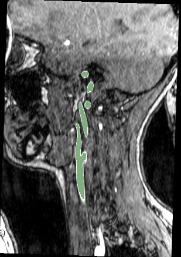
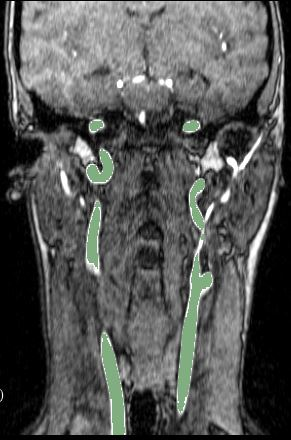

# 3D-Unet: patched based Keras implementation for medical images segmentation

3D-Unet pipeline is a computational toolbox (python-Keras) for segmentation using neural networks. 


The training and the inference are patch based: the script randomly extract corresponding patches of the images and labels and feed them to the network during training.
The inference script extract, segment the sigle patches and automatically recontruct them in the original size.

### Example images

Sample MR images from the sagittal and coronal views for carotid artery segmentation (the segmentation result is highlighted in green)


*******************************************************************************

### Requirements
- Python3
- pillow
- scikit-learn
- simpleITK
- keras
- scikit-image
- pandas
- pydicom
- nibabel
- tqdm
- git+https://www.github.com/farizrahman4u/keras-contrib.git

### Python scripts and their function

- generator.py / NiftiDataset.py : They augment the data, extract the patches and feed them to the GAN (reads .nii files). NiftiDataset.py
  skeleton taken from https://github.com/jackyko1991/vnet-tensorflow

- check_loader_patches: Shows example of patches fed to the network during the training  

- unet3d.py: the architecture of the U-net. Taken from https://github.com/ellisdg/3DUnetCNN

- metrics.py : list of metrics and loss functions for the training

- main.py: Runs the training and the prediction on the training and validation dataset.

- predict.py: It launches the inference on training and validation data in the main.py

- segment_single_image.py: It launches the inference on a single input image chosen by the user.

## Usage

There are several parameters you need to set; you can modify the default ones in the main.py.
Each one is described in the main.py script
For further details you can open each script and read the description and list of commands.

## Features
- 3D data processing ready
- Augmented patching technique, requires less image input for training
- Multichannel input and one channel output (multichannel to be developed)
- Generic image reader with SimpleITK support (Currently only support .nii/.nii.gz format for convenience, easy to expand to DICOM, tiff and jpg format)
- Medical image pre-post processing with SimpleITK filters
- Easy network replacement structure
- Dice score similarity measurement as golden standard in medical image segmentation benchmarking
- Includes Tensorboard to track the training process

## Citations
Use the following Bibtex if you need to cite this repository:
```bibtex
@misc{davidiommi1991_unet_Keras,
  author = {David Iommi},
  title = {3D-Unet: patched based Keras implementation for medical images segmentation},
  howpublished = {\url{https://github.com/davidiommi/3D-U-net-Keras}},
  year = {2020},
  publisher={Github},
  journal={GitHub repository},
}

@misc{jackyko1991_vnet_tensorflow,
  author = {Jacky KL Ko},
  title = {Implementation of vnet in tensorflow for medical image segmentation},
  howpublished = {\url{https://github.com/jackyko1991/vnet-tensorflow}},
  year = {2018},
  publisher={Github},
  journal={GitHub repository},
}